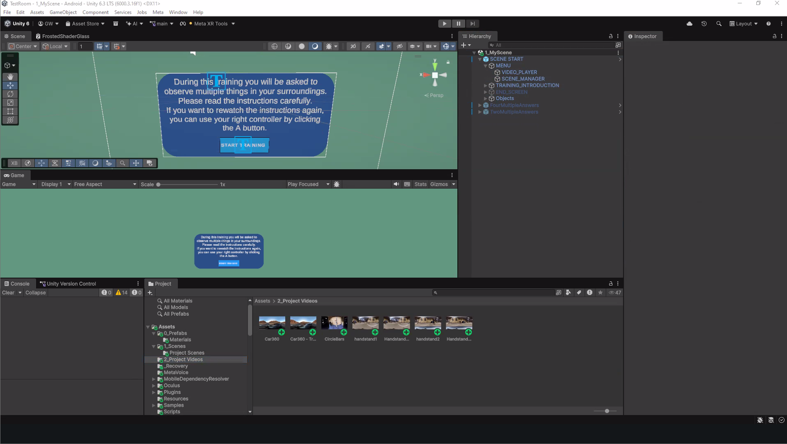

# Create a Scene {#create-a-scene}

This chapter explains how to create and configure a scene using the Unity project template **[Project Template Name]**.

In this project template, each scene corresponds to one video. For example, a training containing three videos will normally require three separate scenes.

---

## Step 1: Import the Videos into Unity {-}

Begin by importing the videos that you plan to use in the training.

1. Locate the **Project** panel in Unity.
2. Open the `2Project_Videos` folder.
3. Drag the video files from your computer into the `Project_Videos` folder.
4. Wait for Unity to finish importing the files.

> **Tip:** Give each video a short, descriptive filename that reflects its position in the training sequence.

For example:

```text
01-introduction.mp4
02-demonstration.mp4
03-practice.mp4
```

```{r import-project-image, echo=FALSE, out.width="100%", fig.align="center", fig.cap="Importing the project into Unity Hub."}

```

---

## Step 2: Create a New Scene {-}

Create a new scene for each video in the training.

1. In the **Project** panel, open the following path:

   `Assets > 1_Scenes > Project_Scenes`

> **Important:** Take into account that each scene represents one video, so if you have multiple scenes, you will have to create multiple scenes. 

2. In the right side you will see the following scenes 0_STARTING SCENE, 1_MyScene and LAST SCENE
3. To create a new scene right click and change the name to 1_Scene_Name

Use a sequence number and a descriptive title to keep the scenes organized.

For example:

```text
01_Introduction
02_Demonstration
03_Practice
```
 4. Write the instructions you want your participants to see at the beginning of the training. In the ***Hierarchy*** panel open the path: `SCENE START > TRAINING_INTRODUCTION`

---

## Step 3: Add a Video to the Scene {-}

After creating the scene, assign the corresponding video to it.

1. Find the scene you want to upload the video on 
  `Assets > 1_Scenes > Project_Scenes > [YOUR SCENE NAME]`
2. Double-click the scene you want to upload the videos.
2. Confirm that the correct scene name appears at the top of the **Hierarchy** panel.

> **Important:** It is not enough to click once on the scene. Unity has to open the object scene. Always make sure to double click. 

3. In the **Hierarchy** panel, open the following path:

   `SceneStart > MENU > VIDEO PLAYER`

4. Select **VIDEO PLAYER**.
5. Locate the **Inspector** panel.
6. Find the **Video Player** subsection.
7. Locate the **Video Clip** field.
8. Drag the appropriate video from the `1_Project_Videos` folder into the **Video Clip** field.

> **Tip:** Remember that you can find the videos in the ***Project*** panel in `Assets > 1_Scenes > Project_Scenes`

9. Play the scene by double clicking on it to  confirm that the correct video appears.
10. Save the scene by pressing `Ctrl + S`.

---

## Step 4: Set up the Questions {-}

> **Note:** In this section you will have to set up content of the instructions for each question, the content of each question, the content of the multiple answers for each questions, which answer will be considered correct, the content of the correct feedback (i.e., when answering correct) and corrective feedback (i.e., when answering incorrect) 

1. In the ***Project*** panel locate `Assets > Prefabs` 
2. Depending on the number of multiple answers you want Drag *FourMultipleAnswers* or *TwoMultipleAnswers* to the ***Hierarchy*** panel in the gray area 

> **Note:** Make sure that it appears under SCENE START and not in one of is folders, as shown in the image. If it appears under SCENE START simply delete it and drag it again. 

3. Select *FourMultipleAnswers* or *TwoMultipleAnswers* and in the ***Inspector*** panel go the section **_EDIT EVERYTHING BELOW THIS_**:

    - **3.1.** Edit the content of the instruction text: change the text that says `Write the content of the instructions here`
    - **3.2.** Edit the content of the question: change the text that says `Write the content of the question here`
    - **3.3.** Edit the content of the multiple answers: write each answer right in the Answer Choice 1, ... Each answer choice box corresponds to one of the answers. 
    - **3.4.** Edit the content of the correct feedback: change the text that says `Write your correct feedback here`
    - **3.5.** Edit the content of the corrective feedback: change the text that says `Write your corrective feedback here` 

4. To choose which answer will be considered as correct, write the number of the answer in the `Conrrect Answer Choice`.
5. Repeat steps 3 and 4 for each question you have. 

> **Note:** You have the option of providing more detailes corrective feedback if the participant answers wrong multiple times the same question. You can write more detailed feedback on the subsections `Corrective Feedback Text  2`, `Corrective Feedback Tex 3` and `Corrective Feedback Tex 4`. 


Use the **Scene Manager** to determine when questions will appear during the video.

### Open the Dynamic Sequence Setup

1. In the **Hierarchy** panel, select ***SCENCE MANAGER*** in the the following path:

   `SCENE START > MENU > SCENE MANAGER`

2. Go to the **Inspector** panel, locate **Dynamic Sequence Setup**.

You will see two main lists:

| List | Purpose |
|---|---|
| **Question Canvases** | Determines which question appears at each pause. In other words, the order of questions |
| **Pause At** | Determines when the video pauses for each question om seconds|

#### Configure Question Canvases

3. Drag the questions objects that you have from the ***Hierarchy*** panel to the Question Canvases
4. Write the time in the video where the questions should appear. Take into account that the numbers are in second, and they should correspond to the seconds in the Video. 


#### Configure the Pause Times

1. Set the number of items equal to the number of questions in the scene.
2. Enter the video time at which each question should appear.
3. Arrange the timestamps in chronological order.

For example:

| Item | Pause time |
|---:|---:|
| 0 | 60 seconds |
| 1 | 120 seconds |
| 2 | 180 seconds |

In this example, the questions will appear at 1:00, 2:00, and 3:00 minutes.

### Verify that the scenes are connected

1. Open the scenes in the ***Project*** panel `ASSETS > 1_SCENES > PROJECT SCENES`
2. Leave the scenes open 
3. In the ***Hierarchy*** panel, in the subsection **Scence Settings**write the name of the scene that will appear after the video ends. If it is the end of the tutorial, write `LAST SCENE`, so that it connects to the last scene of the project. 


---

## Step 5: Verify the Question Order {-}

Before continuing, confirm that:

- Every pause time has a corresponding question canvas.
- The pause times are arranged chronologically.
- The question canvases are arranged in the intended order.
- The number of items in both lists is identical.
- Each question is associated with the correct point in the video.

> **Warning:** Questions may appear at the wrong times when the order of the question canvases does not match the order of the pause times.

---

## Step 6: Edit the Beginning Screen {-}

The beginning screen introduces the training before the video starts.

1. Locate **BeginSceneCanvas** in the **Hierarchy** panel.
2. Expand the canvas to locate its text elements.
3. Select the header text.
4. In the **Inspector** panel, replace the existing text with the introduction for your training.
5. Save the scene.

For example:

> Welcome to the caregiver training. In this module, you will observe a caregiver responding to a child during a daily routine.

Keep the introduction:

- Brief
- Easy to read
- Relevant to the video
- Consistent with the purpose of the training module

---

## Step 7: Edit the End Screen {-}

The end screen determines which scene will open after the current scene is completed.

1. Locate **End Screen** inside the **SceneStart** prefab.
2. Select the field that identifies the next scene.
3. Enter the exact name of the scene that should open next.

For example:

```text
02 Demonstration
```

> **Important:** The scene name must be written exactly as it appears in the Unity scene list. Differences in capitalization, spacing, or punctuation may prevent Unity from opening the scene.

### Configure the Final Scene

When the current scene is the final scene in the training, enter:

```text
Last Scene
```

Make sure that `Last Scene` matches the text expected by the project template exactly.

---

## Step 8: Add the Scene to the Build Profile

Every new scene must be added to the Unity build profile.

1. Open the scene that you want to add.
2. Select **File** from the Unity menu.
3. Select **Build Profiles**.
4. Click **Open Scene List**.
5. Click **Add Open Scenes**.
6. Confirm that the scene appears in the scene list.

Repeat this process whenever you create a new scene.

> **Important:** A scene that is not included in the build profile may work inside the Unity Editor but fail to open in the completed application.

---

## Step 9: Save the Scene

Save the scene after making any changes by pressing:

```text
Ctrl + S
```

You should save the scene after:

- Assigning a video
- Changing question timestamps
- Adding question canvases
- Editing the beginning screen
- Editing the end screen
- Adding the scene to the build profile

---

## Scene Configuration Checklist

Before moving to the next scene, confirm that:

- [ ] The scene has a clear and unique name.
- [ ] The correct video has been assigned.
- [ ] The video plays correctly.
- [ ] The number of pause times matches the number of questions.
- [ ] Each question canvas is in the correct position.
- [ ] The beginning-screen text has been updated.
- [ ] The next-scene name has been entered correctly.
- [ ] The scene has been added to the build profile.
- [ ] The scene has been saved.

After completing this checklist, repeat the process for the next video in the training.